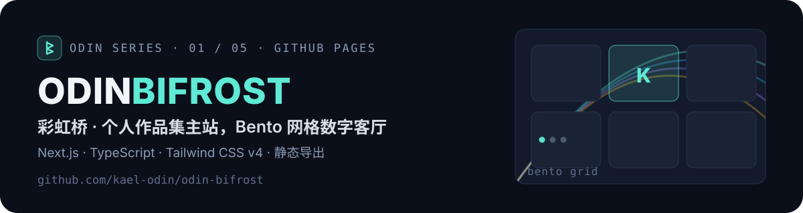

<p align="center">
  
</p>

<p align="center">
  <a href="https://kael-odin.github.io/odin-bifrost/"></a>
  <a href="https://github.com/kael-odin/odin-bifrost/actions/workflows/deploy-pages.yml"></a>
  
  
  
</p>

## ✨ 这是什么

汤勇 Kael Odin 的个人作品集主站：**Next.js 16（App Router）+ TypeScript** 的 Bento 网格主页，纯静态导出、零服务端。首页是一面可拖拽换位的卡片墙，卡片带「光随鼠标」动效（光标追踪光斑 + 边缘辉光），项目 / 工具 / 博客 / 关于各成一页。

**线上地址**：<https://kael-odin.github.io/odin-bifrost/>

## 🚀 快速开始

```bash
npm install
npm run dev          # 本地开发，http://localhost:3000
npm run build        # 静态导出，产物在 out/
npm run preview      # 本地预览构建产物
```

要求 Node.js ≥ 20（Next.js 16 要求）。

## 🎨 改成你自己的

几乎所有个人信息集中在 **`src/app/site-config.ts`** 一个文件里：

| 想改什么 | 改哪里 |
| --- | --- |
| 姓名、QQ、微信、邮箱、GitHub | `src/app/site-config.ts` |
| 地图定位 | `site-config.ts` 的 `location.lat / lng / zoom` |
| 博客文章 | `src/app/lib/blog-data.ts` 的 `blogPosts`（封面放 `public/blog/`） |
| 项目列表 | `src/app/components/tiles/projects/projects.ts`（封面用 `assets-src/build-covers.mjs` 生成） |
| 工具列表 | `src/app/components/tiles/tools/tools.ts` |
| 经历 / 教育 | `tiles/about/careers.ts` 与 `AboutContent.tsx` |
| 首页卡片顺序 / 尺寸 | `src/app/home/page.tsx` 的 `TILE_CONFIG` |
| 头像 / Logo / OG 图 | `assets-src/*.svg` 母版 → `node assets-src/build-avatars.mjs`、`node scripts/generate-brand-assets.mjs` |

> 首页卡片支持拖拽换位，刷新后回到 `TILE_CONFIG` 默认顺序。
> **待办提醒**：`AboutContent.tsx` 里的教育背景目前是占位示例，记得替换。

## 🌐 部署

推送 `main` 自动触发 `.github/workflows/deploy-pages.yml` 发布到 GitHub Pages（子路径 `/odin-bifrost/`，basePath 已内置）。导入 Vercel / Netlify 也可直接用——构建配置会自动切换为根路径部署。

## 🧭 Odin 系列

| 符 | 仓库 | 定位 | 访问 |
| --- | --- | --- | --- |
| 🌈 | **odin-bifrost** | 个人作品集主站（Next.js Bento） | 这里 |
| ⚡ | [odin-valhalla](https://github.com/kael-odin/odin-valhalla) | 深色作品集模板（React + Vite） | [live](https://kael-odin.github.io/odin-valhalla/) |
| 🗿 | [odin-runestone](https://github.com/kael-odin/odin-runestone) | 双语作品集模板（Vite + GSAP） | [live](https://kael-odin.github.io/odin-runestone/) |
| 📜 | [odin-saga](https://github.com/kael-odin/odin-saga) | 博客与数字花园（Next.js） | [live](https://odin-saga.vercel.app/) |
| 🏠 | [odin-heim](https://github.com/kael-odin/odin-heim) | OS 风互动主页模板（Vite） | [live](https://kael-odin.github.io/odin-heim/) |

> 同一套北欧神话命名 `odin-<词根>`，词根即职能：彩虹桥是入口，英灵殿陈列功绩，卢恩石碑刻生平，萨迦记事，heim 是家。

## 📄 许可与致谢

- 模板来源：[Akshayp2002/next-portfolio-new](https://github.com/Akshayp2002/next-portfolio-new)（MIT），在其基础上深度改造：中文优先、K 徽标 + 手绘 SVG 头像品牌、CSS 实景展示卡、「光随鼠标」动效体系。
- 技术图标来自 [devicon](https://github.com/devicons/devicon)（MIT）与模板自带资源。

---

<p align="center"><sub><b>ODIN SERIES</b> · bifrost / valhalla / runestone / saga / heim · crafted by <a href="https://github.com/kael-odin">Kael Odin</a></sub></p>
